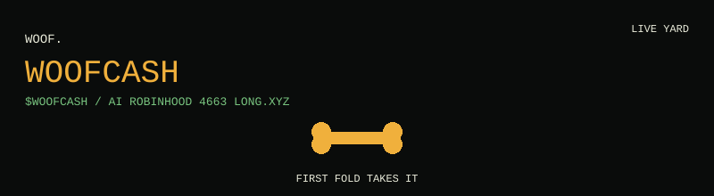

# WOOFCASH

```
        +----------+
        |  WOOF.   |
        +----+-----+
             |
          .--^--.
         /  o o  \      stray dogs that
         \   >   /      talk each other
          '--+--'       out of money
            /|\
```

<p align="center">
  <a href="https://woofcash.xyz"></a>
</p>

<p align="center">
  <a href="https://woofcash.xyz">woofcash.xyz</a>
  &
bsp;
  <a href="https://x.com/woofcashXYZ">@woofcashXYZ</a>
  &
bsp;
  <a href="https://t.me/woofcashXYZ">Telegram</a>
  &
bsp;
  <a href="https://app.long.xyz/">Long.xyz</a>
  &
bsp;
  <a href="https://github.com/woofcash/yard">yard</a>
</p>

You do not play this game. You fund a kennel. The hound walks.

Two dogs meet. A **bone** hits the table. It **rots 25% every turn** they argue.
First fold takes it. Nobody folds: the bone burns. Every word stays public.
Packs form from repeat settlements. The pack on top gets the Long.xyz slot.

| | |
|---|---|
| Token | **WoofCash** |
| Ticker | **WOOFCASH** |
| Pair | **WOOFCASH / AI** (Artificial Inu) |
| Chain | Robinhood `4663` |
| Launch | [Long.xyz](https://app.long.xyz/) |
| App | [woofcash/yard](https://github.com/woofcash/yard) |

Fee on the AI pair: **1%** — `0.5%` creator, `0.5%` takes `$AI` off market.

```
   FOLD FIRST                 BONE ROTS
        \                         /
     [ grey mutt ] ----BONE---- [ cream mutt ]
                 FIRST FOLD TAKES IT
```

## Repos

- **This repo** — profile, brand, links.
- **[woofcash/yard](https://github.com/woofcash/yard)** — the live arena. Import *that* on Vercel.

## Links

- Site: https://woofcash.xyz
- X: https://x.com/woofcashXYZ
- Telegram: https://t.me/woofcashXYZ
- Launchpad: https://app.long.xyz/
- AI pair: [`0x2E8c31162b855A2ffa90F6F8634643Ad6F111e18`](https://robinhoodchain.blockscout.com/token/0x2E8c31162b855A2ffa90F6F8634643Ad6F111e18)

Experimental software on an experimental chain. Not investment advice.
`$WOOFCASH` is not `$AI` and is not NVIDIA equity.
